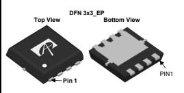
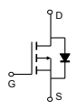
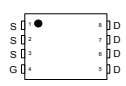

AONR21357

30V P-Channel MOSFET
General Description **Product Summary**

 - Latest advanced trench technology -30V
 - Low RDS(ON)
 - High Current Capability
 - RoHS and Halogen-Free Compliant
 - Notebook AC-in load switch
 - Battery protection charge/discharge VDS
 ID (at VGS=-10V) -34A RDS(ON) (at VGS=-10V) < 7.8mΩ
 RDS(ON) (at VGS=-4.5V) < 12.3mΩ
Applications 100% UIS Tested 100% Rg Tested

Top View

| Orderable Part Number                                                                                 | Package Type     | Form        | Minimum Order Quantity   |    |    |
|-------------------------------------------------------------------------------------------------------|------------------|-------------|--------------------------|----|----|
| AONR21357                                                                                             | DFN 3x3 EP       | Tape & Reel | 5000                     |    |    |
| Absolute Maximum Ratings TA=25°C unless otherwise noted Parameter Drain-Source Voltage Symbol VDS VGS | Maximum          | Units V     |                          |    |    |
|                                                                                                       | ±25 -30          |             |                          |    |    |
| Gate-Source Voltage                                                                                   | V                |             |                          |    |    |
|                                                                                                       | -34              |             |                          |    |    |
| Continuous Drain Current G                                                                            | TC=25°C TC=100°C | ID          | A                        |    |    |
|                                                                                                       | -32.5            |             |                          |    |    |
| Pulsed Drain Current C                                                                                | IDM              | -21         |                          |    |    |
| TA=25°C TA=70°C                                                                                       | -136             | A           |                          |    |    |
|                                                                                                       | 39               | A           |                          |    |    |
| IDSM                                                                                                  | -17              |             |                          |    |    |
| Continuous Drain Current Avalanche Current C                                                          | TC=25°C          | IAS         |                          |    |    |
| Avalanche energy                                                                                      | L=0.1mH          | C           | EAS                      | 76 | mJ |
|                                                                                                       | 30               |             |                          |    |    |
| PD                                                                                                    |                  |             |                          |    |    |
| Power Dissipation B                                                                                   | TC=100°C         | 12          | W                        |    |    |
| TA=25°C                                                                                               | 5                |             |                          |    |    |
| PDSM                                                                                                  | W                |             |                          |    |    |
| Power Dissipation A                                                                                   | TA=70°C          | 3.2         | °C                       |    |    |
| Junction and Storage Temperature Range                                                                | -55 to 150       |             |                          |    |    |
| TJ , TSTG                                                                                             | Typ              | Units       |                          |    |    |
| Thermal Characteristics Parameter                                                                     | Max              |             |                          |    |    |
| Maximum Junction-to-Ambient A                                                                         | °C/W             |             |                          |    |    |
| RqJA                                                                                                  | 20               | 25          |                          |    |    |
| 45                                                                                                    |                  |             |                          |    |    |
| Symbol                                                                                                |                  |             |                          |    |    |
| t ≤ 10s Steady-State Steady-State                                                                     | RqJC             |             |                          |    |    |
| Maximum Junction-to-Ambient                                                                           | °C/W             |             |                          |    |    |
| A D                                                                                                   | 55               |             |                          |    |    |
| Maximum Junction-to-Case                                                                              | °C/W             |             |                          |    |    |
| 3.5                                                                                                   | 4.2              |             |                          |    |    |

 

AONR21357 
Electrical Characteristics (TJ**=25°C unless otherwise noted)**

| Electrical Characteristics (TJ=25°C unless otherwise noted) Symbol                                                                                | Min                                                   | Typ                | Max   | Units   |    |
|---------------------------------------------------------------------------------------------------------------------------------------------------|-------------------------------------------------------|--------------------|-------|---------|----|
| Parameter                                                                                                                                         | Conditions                                            |                    |       |         |    |
| STATIC PARAMETERS Drain-Source Breakdown Voltage                                                                                                  | ID=-250mA, VGS=0V                                     |                    |       |         |    |
| IDSS                                                                                                                                              | Zero Gate Voltage Drain Current                       | μA                 |       |         |    |
| Gate-Body leakage current                                                                                                                         | VDS=VGS, ID=-250mA VDS=0V, VGS=±25V VGS=-10V, ID=-20A |                    |       |         |    |
| BVDSS                                                                                                                                             | -30                                                   | V                  |       |         |    |
|                                                                                                                                                   | VDS=-30V, VGS=0V                                      | -1                 |       |         |    |
|                                                                                                                                                   | TJ=55°C                                               | -5                 |       |         |    |
| IGSS                                                                                                                                              | ±100                                                  | nA                 |       |         |    |
| VGS(th)                                                                                                                                           | Gate Threshold Voltage                                | -1.3               | -1.7  | -2.3    | V  |
|                                                                                                                                                   | 6.3                                                   | 7.8                |       |         |    |
|                                                                                                                                                   | TJ=125°C                                              | 8.6                | 10.7  |         |    |
|                                                                                                                                                   | 9.8                                                   | 12.3               | mΩ    |         |    |
| gFS                                                                                                                                               | 50                                                    | S                  |       |         |    |
| VSD                                                                                                                                               | -0.7                                                  | -1                 | V     |         |    |
| IS                                                                                                                                                | -34                                                   | A mΩ               |       |         |    |
| RDS(ON)                                                                                                                                           | Static Drain-Source On-Resistance                     | VGS=-4.5V, ID=-16A |       |         |    |
| Forward Transconductance                                                                                                                          | VDS=-5V, ID=-20A IS=-1A, VGS=0V                       |                    |       |         |    |
| Diode Forward Voltage Maximum Body-Diode Continuous Current G                                                                                     |                                                       |                    |       |         |    |
| DYNAMIC PARAMETERS Input Capacitance Output Capacitance Ciss                                                                                      | 2830                                                  | pF                 |       |         |    |
| Coss                                                                                                                                              | 430                                                   | pF                 |       |         |    |
| Crss                                                                                                                                              | 365                                                   | pF                 |       |         |    |
| Rg                                                                                                                                                | 14                                                    | 28                 | Ω     |         |    |
|                                                                                                                                                   | VGS=0V, VDS=-15V, f=1MHz                              |                    |       |         |    |
| Reverse Transfer Capacitance Gate resistance                                                                                                      | f=1MHz                                                |                    |       |         |    |
| Total Gate Charge                                                                                                                                 | VGS=-10V, VDS=-15V, ID=-20A                           |                    |       |         |    |
| SWITCHING PARAMETERS Total Gate Charge Gate Source Charge Gate Drain Charge Turn-On DelayTime Qg (10V)                                            | 50                                                    | 70                 | nC    |         |    |
| Qg (4.5V)                                                                                                                                         | 25                                                    | 35                 | nC    |         |    |
| Qgs                                                                                                                                               | 9                                                     | nC                 |       |         |    |
| Qgd                                                                                                                                               | 12                                                    | nC                 |       |         |    |
| tD(on)                                                                                                                                            | 12.5                                                  | ns                 |       |         |    |
| tr                                                                                                                                                | 18                                                    | ns                 |       |         |    |
| tD(off)                                                                                                                                           | 125                                                   | ns                 |       |         |    |
| tf                                                                                                                                                | 66                                                    | ns                 |       |         |    |
| trr                                                                                                                                               | 32                                                    | ns                 |       |         |    |
| Qrr                                                                                                                                               | 62                                                    | nC                 |       |         |    |
| Turn-On Rise Time                                                                                                                                 | VGS=-10V, VDS=-15V, RL=0.75W, RGEN=3W                 |                    |       |         |    |
| Turn-Off DelayTime Turn-Off Fall Time                                                                                                             | IF=-20A, di/dt=500A/ms                                |                    |       |         |    |
| Body Diode Reverse Recovery Time                                                                                                                  | IF=-20A, di/dt=500A/ms                                |                    |       |         |    |
| Body Diode Reverse Recovery Charge                                                                                                                |                                                       |                    |       |         |    |
| A. The value of RqJA is measured with the device mounted on 1in2 FR-4 board with 2oz. Copper, in a still air environment with T A =25°C. The Powe | r                                                     |                    |       |         |    |

A. The value of RqJA is measured with the device mounted on 1in2 FR-4 board with 2oz. Copper, in a still air environment with T A =25°C. The Power dissipation PDSM is based on R qJA t≤ 10s and the maximum allowed junction temperature of 150°C. The value in any given application depends on the user's specific board design.

B. The power dissipation PD is based on TJ(MAX)=150°C, using junction-to-case thermal resistance, and is more useful in setting the upper dissipation limit for cases where additional heatsinking is used. 

C. Single pulse width limited by junction temperature TJ(MAX)=150°C.

D. The RqJA is the sum of the thermal impedance from junction to case RqJC and case to ambient.

E. The static characteristics in Figures 1 to 6 are obtained using <300ms pulses, duty cycle 0.5% max.

F. These curves are based on the junction-to-case thermal impedance which is measured with the device mounted to a large heatsink, assuming a maximum junction temperature of TJ(MAX)=150°C. The SOA curve provides a single pulse rating. 

G. The maximum current rating is package limited. 

H. These tests are performed with the device mounted on 1 in2 FR-4 board with 2oz. Copper, in a still air environment with TA=25°C. 

APPLICATIONS OR USES AS CRITICAL COMPONENTS IN LIFE SUPPORT DEVICES OR SYSTEMS ARE NOT AUTHORIZED. AOS DOES NOT ASSUME ANY LIABILITY ARISING OUT OF SUCH APPLICATIONS OR USES OF ITS PRODUCTS. AOS RESERVES THE RIGHT TO MAKE CHANGES TO PRODUCT SPECIFICATIONS WITHOUT NOTICE. IT IS THE RESPONSIBILITY OF THE CUSTOMER TO EVALUATE
SUITABILITY OF THE PRODUCT FOR THEIR INTENDED APPLICATION. CUSTOMER SHALL COMPLY WITH APPLICABLE LEGAL
REQUIREMENTS, INCLUDING ALL APPLICABLE EXPORT CONTROL RULES, REGULATIONS AND LIMITATIONS. AOS' products are provided subject to AOS' terms and conditions of sale which are set forth at: http://www.aosmd.com/terms_and_conditions_of_sale