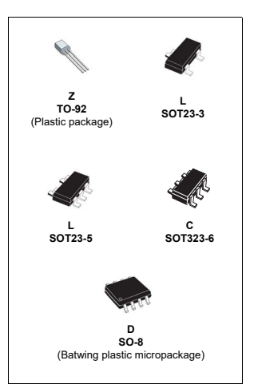
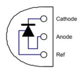
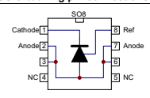
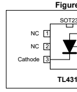
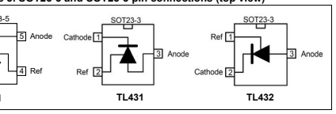
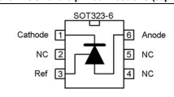
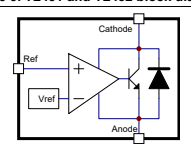

TL431 TL432 Automotive adjustable voltage reference

## Features

 AEC-Q100 qualified Adjustable output voltage: 2.5 to 36 V
 Sink current capability: 1 to 100 mA
 Typical output impedance: 0.22 Ω
 0.5% voltage precision only on the TL431B 
version 1% and 2% voltage precision Automotive temp. range -40 °C to +125 °C
Datasheet - production data

## Applications

 Power supply Industrial Automotive

## Description

The TL431 and TL432 are adjustable shunt voltage references with guaranteed temperature stability over the entire operating temperature range. The device temperature range is extended for the automotive version from -40 °C up to +125 °C. The output voltage can be set to any value between 2.5 and 36 V with two external resistors. The TL431 and TL432 operate with a wide current range from 1 to 100 mA with a typical dynamic impedance of 0.22 Ω.

## Contents

| 1   | Schematic diagrams 3                                                                                                                                                                                                                                                 |    |
|-----|----------------------------------------------------------------------------------------------------------------------------------------------------------------------------------------------------------------------------------------------------------------------|----|
| 2   | Absolute maximum ratings and operating conditions 4                                                                                                                                                                                                                  |    |
| 3   | Electrical characteristics 5 Reference input voltage deviation overtemperature range 8                                                                                                                                                                               |    |
| 4   | Package information 12 4.1 SO-8 package information 13 4.2 TO-92 ammopack and tape and reel package information 14 4.3 TO-92 (bulk) package information 15 4.4 SOT23-3 package information 16 4.5 SOT23-5 package information 17 4.6 SOT323-6 package information 18 |    |
| 5   | Ordering information                                                                                                                                                                                                                                                 | 19 |
| 6   | Revision history                                                                                                                                                                                                                                                     | 21 |

## 1 Schematic Diagrams

Figure 1. TO-92 pin connections (top view)

Figure 2. SO-8 batwing pin connections (top view)

Figure 3. SOT23-5 and SOT23-3 pin connections (top view)

Figure 4. SOT323-6 pin connections (top view)

Figure 5. TL431 and TL432 block diagram

# 2 Absolute Maximum Ratings And Operating Conditions

|        | Table 1. Absolute maximum ratings                                                                                                    |                    |      |
|--------|--------------------------------------------------------------------------------------------------------------------------------------|--------------------|------|
| Symbol | Parameter                                                                                                                            | Value              | Unit |
| VKA    | Cathode to anode voltage                                                                                                             | 37                 | V    |
| Ik     | Continuous cathode current range                                                                                                     | -100 to +150       | mA   |
| Iref   | Reference input current range                                                                                                        | -0.05 to +10       | mA   |
| Rthjc  | Thermal resistance junction to case TO-92 SO-8 batwing SOT23-3L SOT23-5L SOT323-6L                                                   |                    | °C/W |
|        |                                                                                                                                      | 57 30 136 67 110   |      |
| Rthja  | Thermal resistance junction to ambient TO-92 SO-8 batwing SOT23-3L SOT23-5L SOT323-6L                                                |                    | °C/W |
|        |                                                                                                                                      | 200 85 248 157 221 |      |
| Tstg   | Storage temperature range                                                                                                            | -65 to +150        | °C   |
| TJ     | Junction temperature                                                                                                                 | 150                | °C   |
| ESD    | TL431IY, TL431AIY-T: HBM (human body model)(1) TL431-TL432: HBM (human body model) MM: machine model(2) CDM: charged device model(3) | 3000 2000 200 1500 | V    |
| 1.     | Human body model: a 100 pF capacitor is charged to the specified voltage, then discharged through a                                  |                    |      |

|        | Table 2. Operating conditions                                                           |            |      |
|--------|-----------------------------------------------------------------------------------------|------------|------|
| Symbol | Parameter                                                                               | Value      | Unit |
| VKA    | Cathode to anode voltage                                                                | Vref to 36 | V    |
| Ik     | Cathode current                                                                         | 1 to 100   | mA   |
|        | Operating free-air temperature range TL431C/AC TL431I/AI - TL432I/AI TL431B TL431IY/AIY |            |      |
| Toper  | 0 to +70                                                                                |            |      |
|        | -40 to +105 -40 to +125 -40 to +125                                                     | °C         |      |

1. Human body model: a 100 pF capacitor is charged to the specified voltage, then discharged through a 1.5 kresistor between two pins of the device. This is done for all couples of connected pin combinations while the other pins are floating. 

2. Machine model: a 200 pF capacitor is charged to the specified voltage, then discharged directly between two pins of the device with no external series resistor (internal resistor < 5 ). This is done for all couples of connected pin combinations while the other pins are floating.

3. Charged device model: all pins and the package are charged together to the specified voltage and then discharged directly to the ground through only one pin. This is done for all pins.

# 3 Electrical Characteristics

|                                                   | Table 3. TL431C (Tamb = 25 °C unless otherwise specified) TL431C TL431AC                                           |      |       |       |      |       |       |    |
|---------------------------------------------------|--------------------------------------------------------------------------------------------------------------------|------|-------|-------|------|-------|-------|----|
| Symbol                                            | Parameter                                                                                                          |      | Unit  |       |      |       |       |    |
|                                                   | Min.                                                                                                               | Typ. | Max.  | Min.  | Typ. | Max.  |       |    |
| Reference input voltage                           |                                                                                                                    |      |       |       |      |       |       |    |
| Vref                                              | VKA = Vref, Ik = 10 mA, Tamb = 25 °C                                                                               | 2.44 | 2.495 | 2.55  | 2.47 | 2.495 | 2.52  | V  |
| Tmin  Tamb  Tmax                               | 2.423                                                                                                              | -    | 2.567 | 2.453 | -    | 2.537 |       |    |
| Reference input voltage deviation overtemperature |                                                                                                                    |      |       |       |      |       |       |    |
| Vref                                             | range (1)                                                                                                          |      | mV    |       |      |       |       |    |
| VKA = Vref, Ik = 10 mA, Tmin  Tamb  Tmax       | -                                                                                                                  | 3    | 17    | -     | 3    | 15    |       |    |
| Vref Vka ------------                           | Ratio of change in reference input voltage to change  in cathode to anode voltage Ik = 10 mA - VKA = 10 V to Vref | -2.7 | -1.4  | -     | -2.7 | -1.4  | -     |    |
|                                                   | -2                                                                                                                 | -1   | -2    | -1    |      |       |       |    |
| VKA = 36 V to 10 V                               |                                                                                                                    | -    | -     | mV/V  |      |       |       |    |
| Iref                                              | Reference input current Ik = 10 mA, R1 = 10 k, R2 =                                                              | -    | 1.8   | 4     | -    | 1.8   | 4     |    |
| Tamb = 25 °C Tmin  Tamb  Tmax                 | -                                                                                                                  | -    | 5.2   | -     | -    | 5.2   | µA µA |    |
| Iref                                             | Reference input current deviation overtemperature  range Ik = 10 mA, R1 = 10 k, R2 = Tmin  Tamb  Tmax         | -    | 0.4   | 1.2   | -    | 0.4   | 1.2   |    |
| Imin                                              | Minimum cathode current for regulation VKA = Vref                                                                  | -    | 0.5   | 1     | -    | 0.5   | 0.6   | mA |
| Ioff                                              | Off-state cathode current                                                                                          | -    | 2.6   | 1000  | -    | 2.6   | 1000  | nA |
| ZKA                                             | Dynamic impedance(2) VKA = Vref,  Ik = 1 to 100 mA, f  1 kHZ                                                     | -    | 0.22  | 0.5   | -    | 0.22  | 0.5   |   |
| 1.                                                | See definition of Section : Reference input voltage deviation overtemperature range.                               |      |       |       |      |       |       |    |

22
VKA
Ik 
---------------
2. The dynamic impedance is defined as ZKA = 