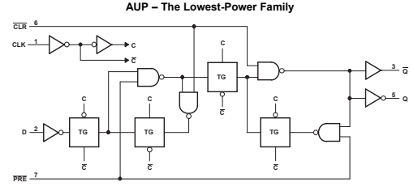
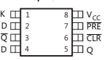
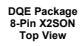
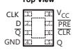
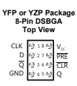
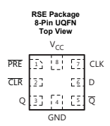

# Sn74Aup1G74 Sces644D –March 2006–Revised December 2015 Sn74Aup1G74 Low-Power Single Positive-Edge-Triggered D-Type Flip-Flop With Clear And Preset

1• Available in the Texas Instruments NanoStar™ - Servers Package - LED Displays
- Low Static-Power Consumption: - Network Switches ICC = 0.9 μA Maximum - Telecom Infrastructure
- Low Dynamic-Power Consumption: - Motor Drivers Cpd = 5.5 pF Typical at 3.3 V• I/O Expanders
- Low Input Capacitance: Ci = 1.5 pF Typical
- Low Noise - Overshoot and Undershoot 3 **Description**
< 10% of VCC The AUP family is TI's premier solution to the
- Ioff Supports Partial-Power-Down Mode Operation industry's low-power needs in battery-powered
- Schmitt-Trigger Action Allows Slow Input portable applications. This family ensures a very low static- and dynamic-power consumption across the Transition and Better Switching Noise Immunity at entire VCC range of 0.8 V to 3.6 V, resulting in the Input increased battery life. This product also maintains (Vhys = 250 mV Typical at 3.3 V) excellent signal integrity (see the very low undershoot
- Wide Operating VCC Range of 0.8 V to 3.6 V and overshoot characteristics shown in Figure 6).

- Optimized for 3.3-V Operation Device Information(1)
- 3.6-V I/O Tolerant to Support Mixed-Mode Signal Operation PART NUMBER PACKAGE BODY SIZE **(NOM)**
SN74AUP1G74YFP DSBGA (8) 1.56 mm × 0.76 mm - tpd = 5 ns Maximum at 3.3 VSN74AUP1G74YZP DSBGA (8) 1.86 mm × 0.89 mm
- Suitable for Point-to-Point Applications SN74AUP1G74DCU VSSOP (8) 2.30 mm × 2.00 mm
- Latch-Up Performance Exceeds 100 mA PerSN74AUP1G74DQE X2SON (8) 1.40 mm × 1.00 mm JESD 78, Class II
SN74AUP1G74RSE UQFN (8) 1.50 mm × 1.50 mm
- ESD Performance Tested Per JESD 22
(1) For all available packages, see the orderable addendum at
- 2000-V Human-Body Model (A114-B, Class II) the end of the data sheet.

- 1000-V Charged-Device Model (C101)



## 1 Features 2 Applications

1

```
Product
       
Folder
     
               Sample &
               Buy
                                Technical
                                         
                                Documents
                                           
                                                    Tools &
                                                           
                                                    Software
                                                            
                                                                     Support &
                                                                     Community

```

SN74AUP1G74


SCES644D –MARCH 2006–REVISED DECEMBER 2015 www.ti.com

|                 | Table of Contents                             |                             |                                      |
|-----------------|-----------------------------------------------|-----------------------------|--------------------------------------|
| 1               | Features 1                                    | 7.2                         | Enable and Disable Times 14          |
| 2               | Applications 1                                | 8                           | Detailed Description 15              |
| 3               | Description 1                                 | 8.1                         | Overview 15                          |
|                 | 8.2                                           | Functional Block Diagram 15 |                                      |
| 4               | Revision History 2                            | 8.3                         | Feature Description 15               |
| 5               | Pin Configuration and Functions 3             | 8.4                         | Device Functional Modes 15           |
| 6               | Specifications 4                              | 9                           | Application and Implementation 16    |
| 6.1             | Absolute Maximum Ratings 4                    | 9.1                         | Application Information 16           |
| 6.2             | ESD Ratings 4                                 | 9.2                         | Typical Power Button Circuit 16      |
| 6.3             | Recommended Operating Conditions 4            | 10                          | Power Supply Recommendations 17      |
| 6.4             | Thermal Information 5                         |                             |                                      |
| 6.5             | Electrical Characteristics, T                 | 11                          | Layout 17                            |
|                 | A = 25°C 5                                    |                             |                                      |
| 6.6             | Electrical Characteristics, T                 | 11.1                        | Layout Guidelines 17                 |
|                 | A = –40°C to +85°C 6                          |                             |                                      |
| 6.7             | Timing Requirements 7                         | 11.2                        | Layout Example 17                    |
| 6.8             | Switching Characteristics, C                  | 12                          | Device and Documentation Support 18  |
|                 | L = 5 pF 8                                    |                             |                                      |
| 6.9             | Switching Characteristics, C                  | 12.1                        | Documentation Support 18             |
|                 | L = 10 pF 9                                   |                             |                                      |
| 6.10            | Switching Characteristics, C                  | 12.2                        | Community Resources 18               |
|                 | L = 15 pF 10                                  |                             |                                      |
| 6.11            | Switching Characteristics, C                  | 12.3                        | Trademarks 18                        |
|                 | L = 30 pF 11                                  |                             |                                      |
| 6.12            | Operating Characteristics 12                  | 12.4                        | Electrostatic Discharge Caution 18   |
| 6.13            | Typical Characteristics 12                    | 12.5                        | Glossary 18                          |
| 7               | Parameter Measurement Information 13          | 13                          | Mechanical, Packaging, and Orderable |
| 7.1             | Propagation Delays, Setup and Hold Times, and | Information 18              |                                      |
| Pulse Width) 13 |                                               |                             |                                      |

## 4 Revision History

NOTE: Page numbers for previous revisions may differ from page numbers in the current version. Changes from Revision C (March 2010) to Revision D **Page** - Added Pin Configuration and *Functions* section, ESD *Ratings* table, Feature *Description* section, Device *Functional* Modes, Application and *Implementation* section, Power Supply *Recommendations* section, *Layout* section, Device and Documentation *Support* section, and Mechanical, Packaging, and Orderable *Information* section .............................. 1


5 Pin Configuration and Functions

CLK



GND


DCU PackageDQE Package 8-Pin VSSOP8-Pin X2SON Top ViewTop **View**






 

|        | Pin Functions(1)                                                     |             |    |    |                                          |
|--------|----------------------------------------------------------------------|-------------|----|----|------------------------------------------|
| PIN    |                                                                      |             |    |    |                                          |
| VSSOP, | I/O                                                                  | DESCRIPTION |    |    |                                          |
| NAME   | UQFN                                                                 | DSBGA       |    |    |                                          |
| X2SON  |                                                                      |             |    |    |                                          |
| CLK    | 1                                                                    | 7           | A1 | I  | Rising edge triggered clock signal input |
| CLR    | 6                                                                    | 2           | C2 | I  | Clear, Active low                        |
| D      | 2                                                                    | 6           | B1 | I  | Data input                               |
| GND    | 4                                                                    | 4           | D1 | -  | Ground                                   |
| PRE    | 7                                                                    | 1           | B2 | I  | Preset, Active low                       |
| Q      | 5                                                                    | 3           | D2 | O  | Output                                   |
| Q      | 3                                                                    | 5           | C1 | O  | Inverted output                          |
| VCC    | 8                                                                    | 8           | A2 | -  | Power supply                             |
| (1)    | See Mechanical, Packaging, and Orderable Information for dimensions. |             |    |    |                                          |

RSE Package 8-Pin **DSBGA**
8-Pin UQFN Top View



