# 5Pb11Xx Datasheet 1.8V To 3.3V High-Performance Lvcmos Clock Buffer Family

## Description

The 5PB11xx is a high-performance LVCMOS clock buffer family of devices. It has an additive phase jitter of 50fs RMS. 

There are five different fan-out variations available: 1:2 to 1:10. The 5PB11xx supports a synchronous glitch-free output enable (OE) function to eliminate any potential intermediate incorrect output clock cycles when enabling or disabling outputs. It can operate from a 1.8V to 3.3V supply. 

## Typical Applications

- Industrial applications - Automotive:
- Radar, Lidar, and other applications

## Features

- High-performance 1:2, 1:4, 1:6, 1:8, 1:10 LVCMOS clock buffer - Very low pin-to-pin skew: < 50ps - Very low additive jitter: < 50fs - Supply voltage: 1.8V to 3.3V - 3.3V tolerant input clock
- fMAX = 200MHz
- Integrated serial termination for 50Ω channel - Packaged in 8-, 14-, 16-, 20-pin TSSOP and as small as 2.0 × 2.0 mm DFN and 3.0 × 3.0 mm VFQFPN packages
- Industrial (-40°C to +85°C) and extended (-40°C to +105°C) 
temperature ranges
- 5PB1104 available in AEC-Q100 qualified, Automotive Grade 1 
(-40°C to +125°C) 
- 5PB1110 available in AEC-Q100 qualified, Automotive Grade 2 
(-40°C to +105°C)

## Block Diagram

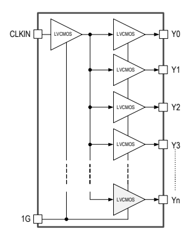

5PB11xx Datasheet

| Contents                                          |
|---------------------------------------------------|
| Description                                       |
| Typical Applications .                            |
| Features .                                        |
| Block Diagram                                     |
| Pin Assignments - TSSOP Packages .                |
| Pin Descriptions - TSSOP Packages                 |
| Pin Assignments - DFNNVFQFPN Packages             |
| Pin Descriptions - DFN/VFQFPN Packages            |
| Output Logic Table                                |
| Absolute Maximum Ratings .                        |
| Recommended Operating Conditions                  |
| Thermal Characteristics .                         |
| DC Electrical Characteristics                     |
| AC Electrical Characteristics                     |
| Phase Noise Plots                                 |
| Test Load and Circuit                             |
| Package Outline Drawings .                        |
| Marking Diagrams (Industrial)                     |
| Marking Diagrams (Extended) .                     |
| Marking Diagrams (Automotive)                     |
| Ordering Information (Industrial)                 |
| Ordering Information (Extended) .                 |
| Ordering Information (Automotive)                 |
| Ordering Information (Special Material Request) . |
| Revision History .                                |

# Pin Assignments - Tssop Packages

Figure 1. Pin Assignments for TSSOP Packages

CLKIN 1

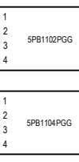

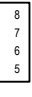

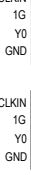

GND NC
VDD NC
Y1 CLKIN 1

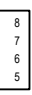

GND Y2 VDD Y3 Y1 CLKIN 1

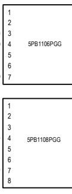

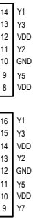

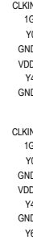

Y0 GND VDD
CLKIN 1 Y6 Y7

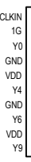

2 3 4 5 6 7 8 9

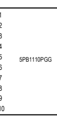

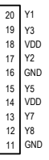

Y9 GND

## Pin Descriptions - Tssop Packages

Table 1. Pin Descriptions for TSSOP Packages

|               | LVCMOS      | Clock Output   |                                     |                |              |
|---------------|-------------|----------------|-------------------------------------|----------------|--------------|
|               | Clock Input | Enable         | LVCMOS Clock Output                 | Supply Voltage | Ground       |
| Device Number | CLKIN       | 1G             | Y0, Y1, ... Y9                      | VDD            | GND          |
| 5PB1102PGG    | 1           | 2              | 3, 8                                | 6              | 4            |
| 5PB1104PGG    | 1           | 2              | 3, 8, 5, 7                          | 6              | 4            |
| 5PB1106PGG    | 1           | 2              | 3, 14, 11, 13, 6, 9                 | 5, 8, 12       | 4, 7, 10     |
| 5PB1108PGG    | 1           | 2              | 3, 16, 13, 15, 6, 11, 8, 9          | 5, 10, 14      | 4, 7, 12     |
| 5PB1110PGG    | 1           | 2              | 3, 20, 17, 19, 6, 15, 8, 13, 12, 10 | 5, 9, 14, 18   | 4, 7, 11, 16 |
