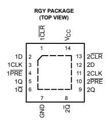

www.ti.com

SN74AUC74 DUAL POSITIVE-EDGE-TRIGGERED D-TYPE FLIP-FLOP

WITH CLEAR AND **PRESET**

SCES483A–AUGUST 2003–REVISED MARCH 2005

## Features

RGY PACKAGE

- Optimized for 1.8-V Operation and Is 3.6-V I/O
Tolerant to Support Mixed-Mode **Signal**
Operation
- I
off Supports Partial-Power-Down Mode Operation
- Sub-1-V **Operable**
- Max t pd of 1.8 ns at 1.8 V
- Low Power Consumption, 10-µA Max ICC

- ±8-mA Output Drive at 1.8 V
- Latch-Up Performance Exceeds 100 mA Per JESD 78, **Class** II
- ESD Protection Exceeds **JESD** 22

- 2000-V Human-Body Model **(A114-A)**
- 200-V Machine Model **(A115-A)**
- 1000-V Charged-Device Model **(C101)**

## Description/Ordering Information

This dual positive-edge-triggered D-type flip-flop is operational at 0.8-V to 2.7-V VCC, but is designed specifically for 1.65-V to 1.95-V VCC operation.

A low level at the preset (PRE) or clear (CLR) inputs sets or resets the outputs, regardless of the levels of the other inputs. When PRE and CLR are inactive (high), data at the data (D) input meeting the setup time requirements is transferred to the outputs on the positive-going edge of the clock pulse. Clock triggering occurs at a voltage level and is not directly related to the rise time of the clock pulse. Following the hold-time interval, data at the D input can be changed without affecting the levels at the outputs. To better optimize the flip-flop for higher frequencies, the CLR input overrides the PRE input when they are both low.

This device is fully specified for partial-power-down applications using Ioff

. The I
off circuitry disables the outputs, preventing damaging current backflow through the device when it is powered down.

ORDERING INFORMATION

| ORDERING INFORMATION   |            |                       |                  |      |
|------------------------|------------|-----------------------|------------------|------|
| TA                     | PACKAGE(1) | ORDERABLE PART NUMBER | TOP-SIDE MARKING |      |
| –40°C to 85°C          | QFN - RGY  | Tape and reel         | SN74AUC74RGYR    | MS74 |

| FUNCTION TABLE   |         |     |    |    |    |
|------------------|---------|-----|----|----|----|
| INPUTS           | OUTPUTS |     |    |    |    |
| PRE              | CLR     | CLK | D  |    |    |
|                  | Q       |     |    |    |    |
|                  |         | Q   |    |    |    |
|                  |         |     |    |    |    |
| L                | H       |     |    |    |    |
|                  | X       | X   | H  |    |    |
|                  |         | L   |    |    |    |
| X                | L       | X   | X  | L  | H  |
|                  |         |     |    |    |    |
| H                |         |     |    |    |    |
|                  | H       |     |    |    |    |
|                  | ↑       | H   |    |    |    |
|                  | H       |     |    |    |    |
|                  |         | L   |    |    |    |
| H                |         |     |    |    |    |
|                  | H       |     |    |    |    |
|                  | ↑       | L   | L  | H  |    |
|                  |         |     |    |    |    |
| H                |         |     |    |    |    |
|                  | H       |     |    |    |    |
|                  | L       | X   | Q0 | Q  |    |
|                  |         | 0   |    |    |    |

(1) Package drawings, standard packing quantities, thermal data, symbolization, and PCB design guidelines are available at www.ti.com/sc/package.

FUNCTION TABLE

Please be aware that an important notice concerning availability, standard warranty, and use in critical applications of Texas Instruments semiconductor products and disclaimers thereto appears at the end of this data sheet.

PRODUCTION DATA information is current as of publication date. Copyright © 2003–2005, Texas Instruments Incorporated Products conform to specifications per the terms of the Texas Instruments standard warranty. Production processing does not necessarily include testing of all parameters.
