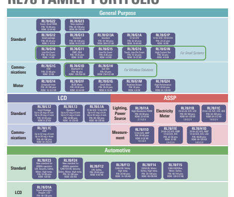

RENESAS RL78 FAMILY 

The Renesas RL78 contributes to greatly improve power efficiency, BOM cost reduction, and equipment miniaturization with industry-leading low power consumption and various built-in high-performance peripheral functions.

## Comprehensive Development Tools

 Improve development efficiency with code generation tool/integrated development environment Support for powerful tools from Renesas partners Open source (compiler/IDE) environment are available Immediately realize Rapid Prototyping in Arduino compatible environment

## Reliable Safety Functions

 Memory with ECC Compliant with Safety Standard for Household Appliances (IEC 60730)
 Support for high operating temperatures (up to 150°C)
 Abnormal operation detection/
avoidance function True Random Number Generator (TRNG)

## Low Power Consumption **Broad Scalability**

 37.5 µA/MHz operation*1 0.355 µA (RTC + LVD)
 SNOOZE mode Note: 1. Power supply current value during basic RL78/G22 operation

## Reduced System Cost **High Performance**

 High precision ±1% high-speed on-chip oscillator On-chip power-on reset, low-voltage detection circuit, temperature sensor, data flash memory, etc.

 Built-in logic function (ELCL), AMP, DAC, 
comparator (some products)
 8 to 144 pins/1 to 768 KB
Extensive product lineup to meet a broad range of requirements Pin compatibility Ability to reassign peripheral function pins High processing performance of 1.6 DMIPS/MHz Support for power supply voltages from 1.6 to 5.5 V
 Max. 48 MHz operation RL: Renesas Low power
* Specifications vary depending on the application. Please refer to each product page for details.

## Rl78 Family Portfolio

RL78 - TRUE LOW POWER MICROCONTROLLER FAMILY
It enables customers to build compact and energy-efficient systems at lower cost.

 

ROM: 24-512 KB

# Rl78 Family Applications

The RL78 Family is utilized in a wide variety of applications.

## I1D G11 Industrial Automation G24 I1A G23 I1E G22 G16 G15 G14 G11

 Lineup of microcontrollers for industrial applications requiring high reliability Broad array of compact packages Operating temperature range of –40°C to +105°C, 
and support available for higher temperatures

## Detector

 Improved analog functions necessary for detecting very small sensor signals Support for power-efficient detection when returning to high-speed operation from STOP mode

## Automotive

 F24 F23 F15 F14 F13

 Lineup of highly reliable microcontrollers for automotive applications Support for high operating temperatures (up to 
+150°C)
 CAN communication, safety functions, etc., for automotive applications

## Consumer Electronics

 G23 G10 G22 G16 G15 G13 G13A G12 G1P G1N

 Calendar function (RTC) as standard feature Serial communication, timers, and on-chip highspeed oscillator as standard features

## White Goods

 G23 **G13A** L13 G22 G16 G15 G13 G12 Hardware Support For European Safety Standard For

household appliances (IEC60730)
 Standard temperature range of –40°C to +85°C, 
and support available for higher temperatures (–40°C to +105°C or +125°C)
 On-chip high-speed on-chip oscillator, poweron reset, etc., ideal for cost-sensitive electric household appliances

## Lighting, Power Supply

 I1A G24 G11

 High-resolution PWM output for lighting and power supply control applications Easy-to-use Applilet software (free of charge) 
supporting program development for lighting applications Support for DALI, DMX512, PMBus, and SMBus communication

## Home Automation

 G23 G1H G22 G16 G15 G13 G13A G1D Power Efficiency Among The Best In The Industry For

extended battery life Support for low-voltage operation (1.6 V to (G1H: 
1.8 V and above))
 Standby function with newly added SNOOZE mode for low power consumption during intermittent operation

## Power Tools

 G24 G1F G14 G11

 Proven track record supplying consistently highquality microcontrollers over the long term Ideal microcontroller platform for system development with lineup covering wide range of memory capacities, pin counts, and package options

## Medical/Healthcare

 L1A L13 I1E G1D H1D

 Lineup of compact packages Proven track record supplying major medical equipment manufacturers Active member of Continua Health Alliance

## Metering

 I1B I1C L13 L1C G11 G1H H1D Standby Function That Is Ideal For Low-Power

applications such as meters and measuring devices On-chip analog functions for smartmeters

## Motor Control

 G24 G14 G1F G1G G1M

 On-chip advanced-functionality timers for motor control High-speed on-chip oscillator with accuracy of 
±1%, ideal for low-cost, high-precision solutions