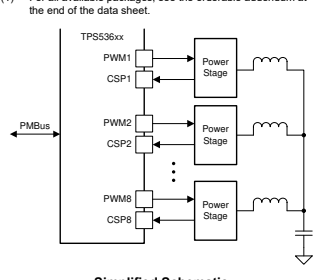

# Tps53688 Dual-Channel (N + M ≤ 8 Phase) D-Cap+™, Step-Down, Digital Multiphase Controller With Vr13.Hc Svid

## 1 Features

- Input Voltage Range: 4.5 V to 17 V - Output Voltage Range: 0.25 V to 5.5 V
- Intel® VR13.HC SVID Compliant
- Dual Output Supporting N+M Phase Configurations (N+M ≤ 8, M ≤ 4)
- Enhanced D-CAP+™ Control to Provide Super Transient Performance with Excellent Dynamic Current Sharing
- Programmable Loop Compensation
- Programmable Phase-Firing Order - Individual Phase Current Calibrations and Reporting
- Dynamic Phase Shedding with Programmable Thresholds for Optimizing Efficiency at Light and Heavy Loads
- Fast Phase-Adding for Undershoot Reduction
(USR)
- Driverless PWM Architecture for Efficient HighFrequency Switching
- Fully Compatible with TI NextFET™ Power Stage for High-Density Solutions
- Accurate, Adjustable, Adaptive Voltage Positioning
(AVP)
- Patented AutoBalance™ Phase Current Balancing
- Cycle-by-cycle Per-Phase Current Limit
- PMBus™ v1.3.1 System Interface for Telemetry of Voltage, Current, Power, Temperature, and Fault Conditions
- 5 mm × 5 mm, 40-Pin, QFN Package

## 2 Applications

- Data center & enterprise computing rack server - Hardware accelerator - Network interface card (NIC) - ASIC and high-performance client

## 3 Description

The TPS53688 is a fully VR13.HC SVID compliant step-down controller with two channels, built-in nonvolatile memory (NVM), and PMBus™ interface, and is fully compatible with TI NexFET™ smart power stages. Advanced control features such as the D-CAP
+™ architecture with undershoot reduction (USR)
provide fast transient response, low output capacitance, and good dynamic current sharing. The device also provides a novel phase interleaving strategy and dynamic phase shedding, for efficiency improvement across loading conditions. Adjustable control of output voltage slew rate and adaptive voltage positioning are natively supported. In addition, the device supports the PMBus communication interface, for reporting the telemetry of voltage, current, power, temperature, and fault conditions to the host system. All programmable parameters can be configured through the PMBus interface and stored in NVM as new default values, to minimize the external component count. The TPS53688 device is offered in a thermally enhanced 40-pin QFN packaged and is rated to operate from –40°C to 125°C.

| Device Information   |            |                 |
|----------------------|------------|-----------------|
| PART NUMBER          | PACKAGE(1) | BODY SIZE (NOM) |
| TPS53688             | QFN (40)   | 5 mm × 5 mm     |

(1) For all available packages, see the orderable addendum at

Simplified Schematic Product Folder Links: *TPS53688*