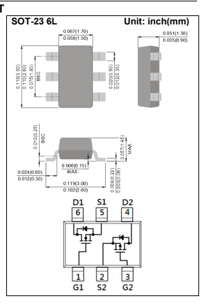

## Pjs6601-Au

20V Complementary Enhancement Mode **MOSFET**

## Features

 Advanced Trench Process Technology Specially Designed for Switch Load, PWM Application, etc.

 AEC-Q101 qualified Lead free in compliance with EU RoHS 2.0 Green molding compound as per IEC 61249 standard

## Mechanical Data

 Case: SOT-23 6L Package Terminals: Solderable per MIL-STD-750, Method 2026 Approx. Weight: 0.0005 ounces, 0.014 grams

Voltage 20 / -20V Current 4.1 /-3.1ASOT-23 **6L Unit: inch(mm)**
Maximum Ratings and Thermal Characteristics (TA=25oC unless otherwise noted)

| PARAMETER                                        | SYMBOL                        | N-Ch LIMIT   | P-Ch LIMIT   | UNITS   |
|--------------------------------------------------|-------------------------------|--------------|--------------|---------|
| Drain-Source Voltage                             | VDS                           | 20           | -20          | V       |
| Gate-Source Voltage                              | VGS                           | +12          | +12          |         |
| Continuous Drain Current(Note 4)                 | ID                            | 4.1          | -3.1         | A       |
| Pulsed Drain Current(Note 1)                     | IDM                           | 16.4         | -12.4        |         |
| Ta=25oC                                          | 1.25                          | W            |              |         |
| Power Dissipation                                | PD                            |              |              |         |
| Derate above 25oC                                | 10                            | mW/ oC       |              |         |
| Operating Junction and Storage Temperature Range | TJ,TSTG                       | -55~150      | oC           |         |
| Typical Thermal Resistance                       | RθJA                          | 100          | oC/W         |         |
| -                                                | Junction to Ambient(Note 3,4) |              |              |         |

