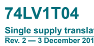

Rev. 2 - 3 December 2019 Product data sheet

## 1. General Description

The 74LV1T04 is a single, level translating inverting buffer. The low threshold inputs support 1.8 V
input logic at VCC = 3.3 V and can be used in 1.8 V to 3.3 V level up translation. In addition, the 5 V
tolerant input pins enable level down translation (3.3 V to 2.5 V output at VCC = 2.5 V). The output level is referenced to the supply voltage and supports 1.8 V, 2.5 V, 3.3 V and 5.0 V CMOS levels.

The wide VCC range permits the generation of output levels to connect to controllers or processors.

## 2. Features And Benefits

- Single supply voltage translator at 1.8 V, 2.5 V, 3.3 V and 5.0 V - Up translation
- 1.2 V to 1.8 V at VCC = 1.8 V - 1.5 V to 2.5 V at VCC = 2.5 V
- 1.8 V to 3.3 V at VCC = 3.3 V
- 3.3 V to 5.0 V at VCC = 5.0 V
- Down translation
- 3.3 V to 1.8 V at VCC = 1.8 V - 3.3 V to 2.5 V at VCC = 2.5 V
- 5.0 V to 3.3 V at VCC = 3.3 V
- 5 V tolerant inputs - Latch-up performance exceeds 250 mA per JESD 78 Class II - ESD protection:
- HBM ANSI/ESDA/JEDEC JS-001 Class 2 exceeds 2 kV - CDM JESD22-C101 exceeds 1 kV
- Specified from -40 °C to +85 °C and from -40 °C to +125 °C

## 3. Applications

- Portable applications

 - PC and notebooks - Industrial controller - Telecom

## 4. Ordering Information

| Table 1. Ordering information Type number Package Temperature range   | Name                                                     | Description   | Version                                               |          |
|-----------------------------------------------------------------------|----------------------------------------------------------|---------------|-------------------------------------------------------|----------|
| 74LV1T04GW                                                            | -40 °C to +125 °C                                        | TSSOP5        | plastic thin shrink small outline package; 5 leads;   | SOT353-1 |
|                                                                       | body width 1.25 mm                                       |               |                                                       |          |
| 74LV1T04GV                                                            | -40 °C to +125 °C                                        | SC-74A        | plastic surface-mounted package; 5 leads              | SOT753   |
| 74LV1T04GX                                                            | -40 °C to +125 °C                                        | X2SON5        | plastic thermal enhanced extremely thin small outline | SOT1226  |
|                                                                       | package; no leads; 5 terminals; body 0.8 x 0.8 x 0.35 mm |               |                                                       |          |

| Table 2. Marking Type number   | Marking code[1]                                                                                |
|--------------------------------|------------------------------------------------------------------------------------------------|
| 74LV1T04GW                     | SG                                                                                             |
| 74LV1T04GV                     | SG                                                                                             |
| 74LV1T04GX                     | SG                                                                                             |
| [1]                            | The pin 1 indicator is located on the lower left corner of the device, below the marking code. |

## 5. Marking 6. Functional Diagram

## 7. Pinning Information 7.1. Pinning

## 7.2. Pin Description

| Table 3. Pin description Symbol   | Pin   | Description    |
|-----------------------------------|-------|----------------|
| n.c.                              | 1     | not connected  |
| A                                 | 2     | data input     |
| GND                               | 3     | ground (0 V)   |
| Y                                 | 4     | data output    |
| VCC                               | 5     | supply voltage |

| Input   | Output   |
|---------|----------|
| A       | Y        |
| L       | H        |
| H       | L        |

## 8. Functional Description
